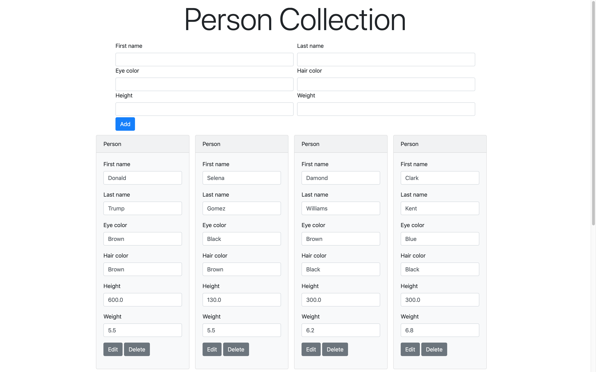

# Basic Person Collection Using JSF & JDBC
I primarily used a modern approach. Using Servlet routing, a `ConnectionPool`, only JSF in my JSP page, and using Bootstrap for a simple, modern interface. I also used basic JDBC, creating basic CRUD operations.
